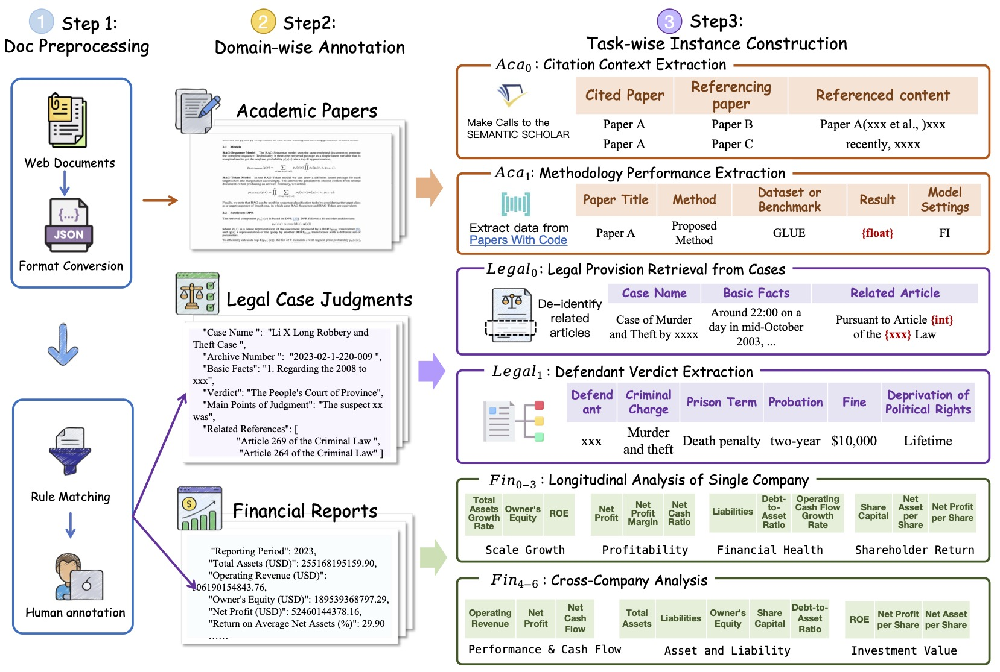

# AOE: Arranged and Organized Extraction Benchmark

[](https://www.python.org/downloads/release/python-3100/)
[](https://huggingface.co/datasets/tianyumyum/AOE/tree/main)
[](https://opensource.org/licenses/MIT)

> **🎯 TL;DR**: AOE is a challenging benchmark that tests Large language models' ability to construct structured tables from multiple documents. Even state-of-the-art models achieve only ~42% F1 score, highlighting significant room for improvement in structured knowledge extraction.


## 🚀 What is AOE?

**AOE (Arranged and Organized Extraction)** is a comprehensive benchmark designed to evaluate how well AI models can construct structured tables from diverse textual sources. Unlike traditional benchmarks that focus on isolated information pieces, AOE emphasizes **holistic understanding** and **reconstruction of complex tabular structures**.

### 🎯 Task Overview



**Core Challenge**: Given multiple documents (4-10 per Instance), models must:
1. 📖 **Understand** the task requirements and target table schema
2. 🔍 **Extract** relevant information across multiple source documents  
3. 🏗️ **Construct** a well-structured table with appropriate columns and rows
4. ✅ **Ensure** accuracy, completeness, and proper formatting

**Domains Covered**:
- 📊 **Financial**: Annual reports, financial statements, market analysis
- ⚖️ **Legal**: Court documents, contracts, regulatory filings  
- 🎓 **Academic**: Research papers, conference proceedings, academic datasets

## 📁 Project Structure

```
AOE/
├── 📋 README.md                               
├── ⚙️ config/                                # Configuration files
│   ├── paths.yaml                          # Path configurations
│   ├── prompt_templates_eval.yaml          # Evaluation templates
│   ├── prompt_templates_one_piece_csv.yaml # Generation templates
│   └── task_config.yaml                    # Task settings
├── 🔧 config_loader.py                       # Configuration manager
├── 📦 requirements.txt                       # Dependencies
├── 🚀 scripts/                               # Execution scripts
│   ├── run_eval.sh                         # Evaluation pipeline
│   └── run_generate.sh                     # Generation pipeline
└── 💻 src/                                   # Source code
    ├── eval/                               # Evaluation modules
    ├── generate/                           # Generation modules
    ├── llm/                                # LLM interfaces
    └── utils.py                            # Utilities
```


## ⚡ Quick Start

### 1️⃣ Clone & Install
```bash
git clone https://github.com/tianyumyum/AOE.git
cd AOE
pip install -r requirements.txt
```

### 2️⃣ Download Data
```bash
mkdir data

# Main benchmark dataset
wget https://huggingface.co/datasets/tianyumyum/AOE/resolve/main/table_data/all_AOE_tables.jsonl -P data/

# Source documents
wget https://huggingface.co/datasets/tianyumyum/AOE/resolve/main/documents.tar -P data/
tar -xvf data/documents.tar -C data/
```

### 3️⃣ Configure Paths
Edit `config/paths.yaml`:
```yaml
base_path: "/path/to/your/AOE"  # ⚠️ Update this path!
```

### 4️⃣ Run Your First Experiment
```bash
# Generate predictions
bash scripts/run_generate.sh

# Evaluate results  
bash scripts/run_eval.sh
```


## 🔬 Experimental Configuration

### Generation Pipeline

**Key Parameters**:

| Parameter | Options | Description |
|-----------|---------|-------------|
| `--model-name` | `"Gemini-2.5-Flash"`, `"deepseek-r1"`, etc. | Target model identifier |
| `--prompt_setting` | `all`, `no_teach`, `no_cot` | Prompt configuration mode |
| `--others` | `""`, `rag` | Processing enhancements |
| `--domains` | `legal`, `financial`, `academic` | Target evaluation domains |

**Prompt Settings Explained**:
- 🎯 **`all`**: Complete prompt with teaching examples + chain-of-thought
- 🧠 **`rag`**: With RAG pipeline

**Example Configurations**:
```bash
# Baseline: Full prompts
"${MODEL_NAME};;"

# Enhanced: RAG + Full prompts  
"${MODEL_NAME};rag;all"

# Minimal: No chain-of-thought
"${MODEL_NAME};;no_cot"
```

### RAG Enhancement Details

When using `--others rag`, the system employs:

| Component | Configuration | Purpose |
|-----------|---------------|---------|
| **Text Splitter** | `chunk_size=512`, `overlap=100` | Optimal context balance |
| **Embeddings** | BGE-M3 model | Dense vector representations |
| **Vector Store** | Chroma database | Efficient retrieval & caching |
| **Retrieval** | Semantic similarity search | Context-aware information access |


## 📊 Evaluation Framework

AOE employs a **comprehensive 3-tier evaluation system**:

### 🎯 Tier 1: CSV Parsability
**What it measures**: Basic structure compliance  
**Metric**: Pass Rate (yes or no)  
**Purpose**: Tests instruction-following and formatting abilities

### 🎯 Tier 2: Overall Quality (LLM-Assessed)  
**What it measures**: Holistic table quality  
**Metric**: Percentage score (0-100%) across 4 dimensions:

| Dimension | Description |
|-----------|-------------|
| 🎯 **Intent Understanding** | Fulfillment of task objectives |
| 🏗️ **Schema Construction** | Logical column design and relevance |
| ✅ **Content Accuracy** | Correctness and completeness |
| 📝 **Format Compliance** | Structural adherence |

### 🎯 Tier 3: Cell-Level Accuracy
**What it measures**: Granular content precision  
**Metric**: Cell F1-Score (0-100%)  
1. **Column Alignment**: Match predicted vs. ground-truth columns
2. **Row Matching**: LLM-assisted semantic row correspondence  
3. **Cell Evaluation**: LLM-based expert evaluation with scoring criteria


## 📈 Evaluation Example

### Input Documents → Ground Truth Table
```csv
文档名称,报表所属期,资产总额(元),资产总额增长率(%),营业收入(元),营业收入增长率(%),所有者权益(元),加权平均净资产收益率(%)
美的集团2020年年度报告摘要,2020,"360,382,603,000",,"284,221,249,000",,"117,516,260,000",24.95
美的集团2021年年度报告摘要,2021,"387,946,104,000",7.65,"341,233,208,000",20.06,"124,868,124,000",24.09
美的集团2022年年度报告摘要,2022,"422,555,267,000",8.92,"343,917,531,000",0.79,"142,935,236,000",22.21
美的集团2023年年度报告摘要,2023,"486,038,184,000",15.02,"372,037,280,000",8.18,"162,878,825,000",22.23
```

### Model Prediction
```csv
文档名称,报表所属期,资产总额(元),资产总额增长率(%),营业收入(元),营业收入增长率(%),所有者权益(元)
美的集团2020年年度报告摘要.md,2020年,"360,382,603,000",19.35,"284,221,249,000",2.16,"117,516,260,000"
美的集团2021年年度报告摘要.md,2021年,"387,946,104,000",7.65,"341,233,208,000",20.06,"124,868,124,000"
美的集团2022年年度报告摘要.md,2022年,"422,555,267,000",8.92,"343,917,531,000",0.79,"142,935,236,000"
美的集团2023年年度报告摘要.md,2023年,"486,038,184,000",15.02,"372,037,280,000",8.18,"162,878,825,000"
```


### Evaluation Results
```json
{
    "if_csv_parsed": {   // ✅ Perfect structure
        "direct": 1,
        "mapped": 1
    },
    "one_piece": {     // 🎯 Good semantic understanding  
        "score1": 85,  // Intent Understanding
        "score2": 80,  // Schema Construction  
        "score3": 75,  // Content Accuracy & Completeness
        "score4": 80   // Format Compliance
    },
    "cell_scores": {   // 📊 High content accuracy
        "column_recall": 1.0,
        "row_precision": 1.0,
        "row_recall": 1.0,
        "row_f1": 1.0,
        "cell_precision": 0.643,
        "cell_recall": 0.643,
        "cell_f1": 0.643,
        "total_compared_cells_in_matched": 28,
        "average_cell_score_in_matched": 0.643
    }
}
```


## 🏆 Benchmark Results

### 🧠 Chain-of-Thought Impact Analysis

> **Key Finding**: Even state-of-the-art models struggle significantly with AOE, with best performers achieving only ~42% Cell-F1 score.

**Top Performing Models**:

| Model | Domain | LLM Score | Pass Rate | Cell F1 |
|-------|--------|-----------|-----------|---------|
| 🥇 **Gemini-2.5-Flash** | Financial | **67.87%** | 80.0% | **26.40%** |
| 🥈 **Doubao-1.5-Pro** | Legal | **80.65%** | 73.0% | **42.12%** |
| 🥉 **Qwen2.5-72B** | Financial | 62.33% | 88.0% | 14.78% |

<details>
<summary><strong>👆 Click to expand full results</strong></summary>

| Model | Setting | **Financial** ||| **Legal** ||| **Academic** |||
|-------|---------|:---:|:---:|:---:|:---:|:---:|:---:|:---:|:---:|:---:|
|       |         | **LLM Score (%)** | **Pass Rate (%)** | **Cell F1 (%)** | **LLM Score (%)** | **Pass Rate (%)** | **Cell F1 (%)** | **LLM Score (%)** | **Pass Rate (%)** | **Cell F1 (%)** |
| **Llama-3.1-8B-Instruct** | Base | 12.63 | 11.00 | 1.04 | 22.13 | 7.00 | 4.20 | 31.66 | 14.00 | 0.90 |
|  | +CoT | 24.99 | 34.00 | 3.76 | 21.28 | 17.00 | 3.41 | 33.81 | 36.00 | 2.70 |
| **phi-3.5-mini-128k-instruct** | Base | 27.23 | 81.00 | 0.38 | 29.13 | 40.00 | 2.20 | 34.53 | 85.00 | 0.00 |
|  | +CoT | 31.90 | 75.00 | 1.17 | 24.05 | 29.00 | 1.48 | 36.97 | 45.00 | 0.79 |
| **Mistral-7B-Instruct-v0.3** | Base | 34.56 | 66.00 | 0.81 | 38.38 | 20.00 | 3.79 | 38.76 | 80.00 | 0.00 |
|  | +CoT | 38.71 | 80.00 | 6.15 | 31.83 | **87.00** | 1.04 | 38.02 | 72.00 | 0.90 |
| **Google/Gemma-3-27b-it** | Base | 44.80 | 88.00 | 0.50 | 68.46 | 35.00 | 11.19 | 47.59 | 85.00 | 0.00 |
|  | +CoT | 32.10 | 73.00 | 8.60 | 52.18 | 53.00 | 18.61 | 58.07 | 68.00 | 0.12 |
| **Deepseek-R1-distill-Llama-70b** | Base | 49.60 | 97.00 | 0.71 | 39.39 | 41.00 | 15.56 | 45.97 | 95.00 | 2.82 |
|  | +CoT | 53.97 | **99.00** | 13.41 | 42.23 | 61.00 | 18.05 | 56.81 | 42.00 | 16.25 |
| **GLM-4-9b-chat** | Base | 48.68 | 67.00 | 2.38 | 62.46 | 76.00 | 24.37 | 40.72 | 59.00 | 1.90 |
|  | +CoT | 56.75 | 89.00 | 14.01 | 58.35 | 53.00 | 22.44 | 45.60 | **97.00** | 2.66 |
| **Qwen2.5-72B-Instruct-gptq-int4** | Base | 52.76 | 94.00 | 0.73 | 69.38 | 61.00 | 33.53 | 43.92 | 84.00 | 0.00 |
|  | +CoT | 62.33 | 88.00 | 14.78 | 76.73 | 53.00 | 40.29 | 56.85 | 73.00 | 5.75 |
| **Doubao-1.5-pro-256k** | Base | 48.67 | 95.00 | 1.12 | 74.44 | 35.00 | 12.42 | 56.48 | 70.00 | 7.61 |
|  | +CoT | 63.78 | 67.00 | 22.36 | **80.65** | 73.00 | **42.12** | 60.72 | 51.00 | **20.80** |
| **Gemini-2.5-flash-preview** | Base | 60.59 | 94.00 | 1.58 | 70.36 | 64.00 | 21.96 | 51.46 | 57.00 | 3.31 |
|  | +CoT | **67.87** | 80.00 | **26.40** | 75.32 | 73.00 | 38.73 | **63.31** | 72.00 | 18.17 |

### AOE Challenges RAG

Contrary to expectations, RAG enhancement shows **inconsistent and often negative impact** on performance, highlighting fundamental challenges in retrieval-based augmentation for complex analytical tasks.

| Model | Setting | **Financial** ||| **Legal** ||| **Academic** |||
|-------|---------|:---:|:---:|:---:|:---:|:---:|:---:|:---:|:---:|:---:|
|       |         | **Overall Score (%)** | **Pass Rate (%)** | **Cell F1 (%)** | **Overall Score (%)** | **Pass Rate (%)** | **Cell F1 (%)** | **Overall Score (%)** | **Pass Rate (%)** | **Cell F1 (%)** |
| **Google/Gemma-3-27b-it** | +CoT | 32.10 | 79.91 | 8.60 | 52.18 | 73.33 | 18.61 | 58.07 | 71.62 | 0.12 |
|  | +RAG+CoT | 38.70 ↑ | 96.85 ↑ | 8.00 ↓ | 38.89 ↓ | 95.83 ↑ | 6.04 ↓ | 55.96 ↓ | 94.29 ↑ | 2.70 ↑ |
| **Glm-4-9b-chat** | +CoT | 56.75 | 80.49 | 14.01 | 58.35 | 86.67 | 22.44 | 45.60 | 71.62 | 2.66 |
|  | +RAG+CoT | 50.44 ↓ | 93.69 ↑ | 9.15 ↓ | 30.59 ↓ | 90.67 ↑ | 6.22 ↓ | 40.51 ↓ | **96.97** ↑ | 0.76 ↓ |
| **Deepseek-R1-distill-Llama-70b** | +CoT | 53.97 | 88.84 | 13.41 | 42.23 | 53.33 | 18.05 | 56.81 | 97.30 | 16.25 |
|  | +RAG+CoT | 53.59 ↓ | 97.32 ↑ | 9.87 ↓ | 47.92 ↑ | 87.01 ↑ | 18.08 ≈ | 52.65 ↓ | 91.78 ↓ | 9.05 ↓ |
| **Qwen2.5-72B-Instruct-gptq-int4** | +CoT | 62.33 | 73.21 | 14.78 | 76.73 | 53.33 | 40.29 | 56.85 | 67.57 | 5.75 |
|  | +RAG+CoT | **68.97** ↑ | 98.36 ↑ | **34.37** ↑ | 69.28 ↓ | 91.49 ↑ | 35.88 ↓ | **77.08** ↑ | 100.00 ↑ | 18.89 ↑ |
| **Doubao-1.5-pro-256k** | +CoT | 63.78 | 99.09 | 22.36 | **80.65** | 61.33 | **42.12** | 60.72 | 41.89 | **20.80** |
|  | +RAG+CoT | 61.57 ↓ | **99.64** ↑ | 15.79 ↓ | 59.54 ↓ | 81.33 ↑ | 30.31 ↓ | 51.59 ↓ | 72.97 ↑ | 6.90 ↓ |
| **gemini-2.5-flash-preview** | +CoT | 67.87 | 66.96 | 26.40 | 75.32 | 73.17 | 38.73 | 63.31 | 51.35 | 18.17 |
|  | +RAG+CoT | 66.71 ↓ | 88.39 ↑ | 23.56 ↓ | 48.28 ↓ | **98.61** ↑ | 26.42 ↓ | 59.11 ↓ | 60.81 ↑ | 7.68 ↓ |

</details>


### 🔍 RAG Enhancement Analysis  

> **Surprising Finding**: RAG shows inconsistent and often negative impact, revealing fundamental challenges in retrieval-based augmentation.

**RAG Performance Changes**:

| Model | Domain | Overall Score | Cell F1 | Trend |
|-------|--------|---------------|---------|-------|
| **Qwen2.5-72B** | Financial | 62.33% → **68.97%** | 14.78% → **34.37%** | 📈 **Strong Improvement** |
| **Doubao-1.5-Pro** | Legal | **80.65%** → 59.54% | **42.12%** → 30.31% | 📉 **Significant Drop** |
| **Gemini-2.5-Flash** | Academic | 63.31% → 59.11% | 18.17% → 7.68% | 📉 **Performance Loss** |

**RAG Limitations Identified**:
- 🎯 **Semantic vs. Critical Gap**: Retrievers fetch similar but insufficient content
- 📊 **Information-Poor Retrieval**: Favors prose over data-rich numerical evidence
- ⚖️ **Task Misalignment**: General similarity ≠ task-specific relevance

<details>
<summary><strong>👆 Click to expand RAG results</strong></summary>

| Model | Setting | **Financial** | | | **Legal** | | | **Academic** | | |
|-------|---------|:---:|:---:|:---:|:---:|:---:|:---:|:---:|:---:|:---:|
| | | *Overall* | *Pass Rate* | *Cell F1* | *Overall* | *Pass Rate* | *Cell F1* | *Overall* | *Pass Rate* | *Cell F1* |
| **Google/Gemma-3-27b-it** | +CoT | 32.10 | 79.91 | 8.60 | 52.18 | 73.33 | 18.61 | 58.07 | 71.62 | 0.12 |
|  | +RAG+CoT | 38.70 ↑ | 96.85 ↑ | 8.00 ↓ | 38.89 ↓ | 95.83 ↑ | 6.04 ↓ | 55.96 ↓ | 94.29 ↑ | 2.70 ↑ |
| **Glm-4-9b-chat** | +CoT | 56.75 | 80.49 | 14.01 | 58.35 | 86.67 | 22.44 | 45.60 | 71.62 | 2.66 |
|  | +RAG+CoT | 50.44 ↓ | 93.69 ↑ | 9.15 ↓ | 30.59 ↓ | 90.67 ↑ | 6.22 ↓ | 40.51 ↓ | **96.97** ↑ | 0.76 ↓ |
| **Deepseek-R1-distill-Llama-70b** | +CoT | 53.97 | 88.84 | 13.41 | 42.23 | 53.33 | 18.05 | 56.81 | 97.30 | 16.25 |
|  | +RAG+CoT | 53.59 ↓ | 97.32 ↑ | 9.87 ↓ | 47.92 ↑ | 87.01 ↑ | 18.08 ≈ | 52.65 ↓ | 91.78 ↓ | 9.05 ↓ |
| **Qwen2.5-72B-Instruct-gptq-int4** | +CoT | 62.33 | 73.21 | 14.78 | 76.73 | 53.33 | 40.29 | 56.85 | 67.57 | 5.75 |
|  | +RAG+CoT | **68.97** ↑ | 98.36 ↑ | **34.37** ↑ | 69.28 ↓ | 91.49 ↑ | 35.88 ↓ | **77.08** ↑ | 100.00 ↑ | 18.89 ↑ |
| **Doubao-1.5-pro-256k** | +CoT | 63.78 | 99.09 | 22.36 | **80.65** | 61.33 | **42.12** | 60.72 | 41.89 | **20.80** |
|  | +RAG+CoT | 61.57 ↓ | **99.64** ↑ | 15.79 ↓ | 59.54 ↓ | 81.33 ↑ | 30.31 ↓ | 51.59 ↓ | 72.97 ↑ | 6.90 ↓ |
| **gemini-2.5-flash-preview** | +CoT | 67.87 | 66.96 | 26.40 | 75.32 | 73.17 | 38.73 | 63.31 | 51.35 | 18.17 |
|  | +RAG+CoT | 66.71 ↓ | 88.39 ↑ | 23.56 ↓ | 48.28 ↓ | **98.61** ↑ | 26.42 ↓ | 59.11 ↓ | 60.81 ↑ | 7.68 ↓ |
</details>


## 💡 Key Insights & Findings
1. **Challenge Severity**: Even the best-performing models (Gemini-2.5, Doubao-1.5-pro) achieve only **~68% LLM Score** and **~42% Cell F1**, indicating substantial room for improvement in structured extraction tasks.

2. **CoT Impact**: Chain-of-thought reasoning shows mixed results, with some models benefiting significantly while others showing performance degradation, suggesting task-specific optimization needs.

3. **RAG Limitations**: RAG enhancement demonstrates **fundamental misalignment issues**:
   - **Semantic vs. Critical Evidence Gap**: RAG retrievers fetch semantically similar but informationally insufficient content
   - **Example Case**: For "shareholder value analysis" requiring specific metrics (EPS: 12.50), RAG retrieved vague corporate statements (*"committed to creating shareholder value..."*) instead of quantitative data
   - **Information-Poor Retrieval**: Standard semantic similarity favors prose-heavy paragraphs over data-rich tables and numerical evidence

4. **Domain Variability**: Performance varies significantly across domains, with Legal domain showing highest Cell F1 scores but Academic domain demonstrating more consistent Pass Rates.


---

## ❓ FAQ

<details>
<summary><strong>Q: How long does evaluation take?</strong></summary>

**A**: Depends on model and dataset size:
- **Small models (7B-13B)**: ~2-4 hours for full evaluation
- **Large models (70B+)**: ~6-12 hours  
- **API models**: ~1-3 hours (rate limit dependent)
</details>

<details>
<summary><strong>Q: Can I evaluate on custom data?</strong></summary>

**A**: Yes! Follow the JSONL format in `all_AOE_tables.jsonl` and update paths in `config/paths.yaml`.
</details>

<details>
<summary><strong>Q: Why is RAG performance inconsistent?</strong></summary>

**A**: RAG faces unique challenges in structured extraction:
- Semantic similarity ≠ informational utility  
- Numerical data often buried in prose-heavy context
- Standard retrievers favor descriptive over quantitative content
</details>


---

<div align="center">

**⭐ Star this repo if you find AOE useful! ⭐**


</div>